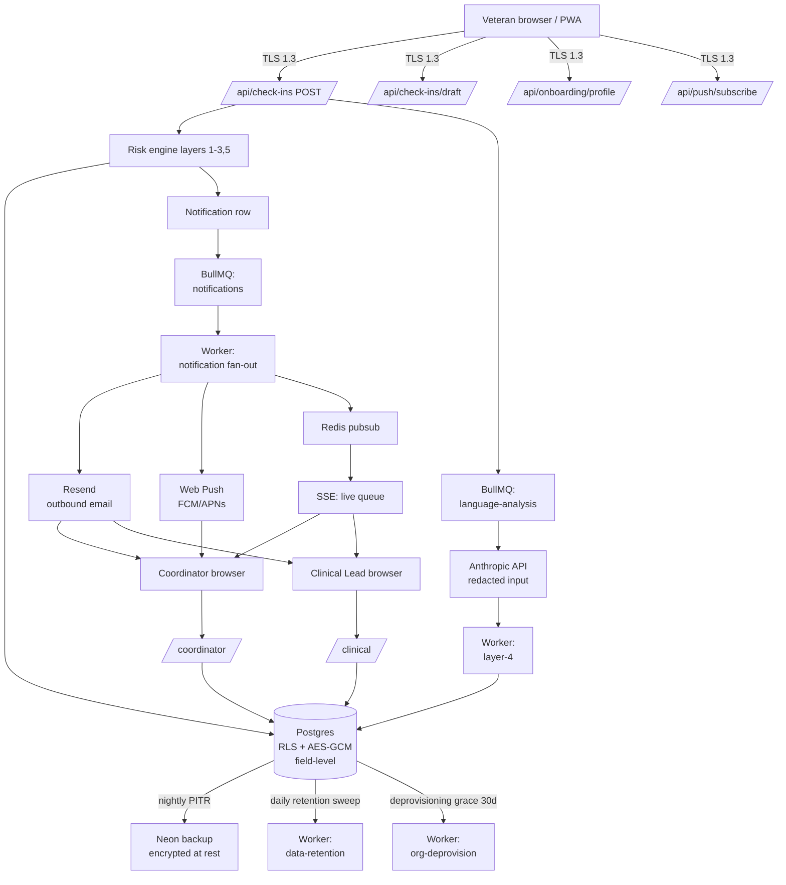

# Data flow

The diagram below traces every category of veteran-touching data from
ingestion through to retention boundary.

## Crossings worth calling out

- **Browser → API**: TLS 1.3 + CSP (nonce + strict-dynamic).
- **API → Anthropic**: payload passes through `redactPII` first. No PHI
  leaves the perimeter; the prompt sees only the open-ended response with
  names/phones/dates redacted.
- **API → Resend**: subject + recipient email. The body is the rendered
  template; veteran free-text never appears in an outbound email.
- **API → Redis**: encrypted in transit (Upstash TLS). Pubsub messages
  carry resource ids only — never PHI.
- **Worker → Postgres**: same RLS + AES-GCM. Workers reconstruct tenant
  context per job and never bypass `withTenant`.

## Subprocessors (BAA status)

| Vendor    | Purpose            | BAA status |
|-----------|--------------------|------------|
| Vercel    | Application host   | Required for prod |
| Neon      | Postgres           | Required for prod |
| Upstash   | Redis              | Required for prod |
| Resend    | Email delivery     | Required for prod |
| Anthropic | Layer-4 LLM        | Required for prod (zero-retention API tier) |
| Sentry    | Error tracking     | Required for prod (with PII scrubbing on) |
| Cloudflare| DNS                | None (no PHI) |

Every BAA is tracked in `docs/compliance/baas/<vendor>.pdf` (not in this
repo — it lives in the org's secure document store).

## Data retention

| Class                         | Default TTL | Knob                              |
|-------------------------------|-------------|-----------------------------------|
| AuditLog                      | 365 days    | `Organization.dataRetentionPolicy.auditLogDays` |
| Notification                  | 90 days     | `dataRetentionPolicy.notificationDays` |
| Session (revoked)             | 30 days     | `dataRetentionPolicy.sessionDays` |
| CheckIn / Message / Consent   | Lifetime of the org | Purged on org deprovisioning + 30d grace |
| Org full purge after deprovision | 30d after `deprovisionedAt` | hardcoded |

## On-deletion

- **Veteran-initiated deletion**: not yet implemented. Deferred per the
  current plan; tracked under the deprovisioning purge path until a real
  state-privacy regime requires it.
- **Org-initiated deletion**: handled by the data-retention worker. Org
  Admin sets `Organization.deprovisionedAt`; 30 days later the worker
  purges all tenant-scoped rows except the deprovisioning audit entry.
